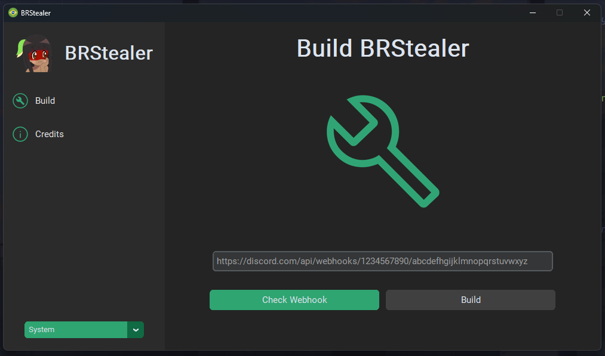

# BRStealer - Builder

### About
A simple builder that replaces the webhook url, obfuscates the code, compiles it, and signs the executable using the signature of another signed executable.

> [!Warning]
This builder is developed exclusively for educational purposes only. I am not responsible for any misuse or consequences resulting from the use of this code. Furthermore, I do not provide support for any issues or questions related to the usage of this builder.